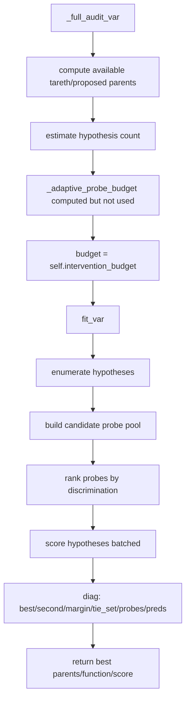
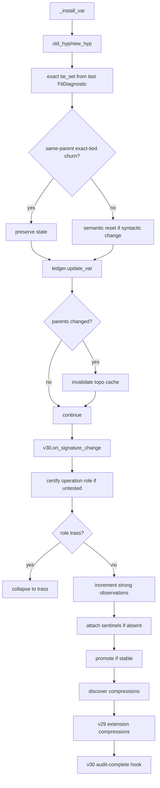
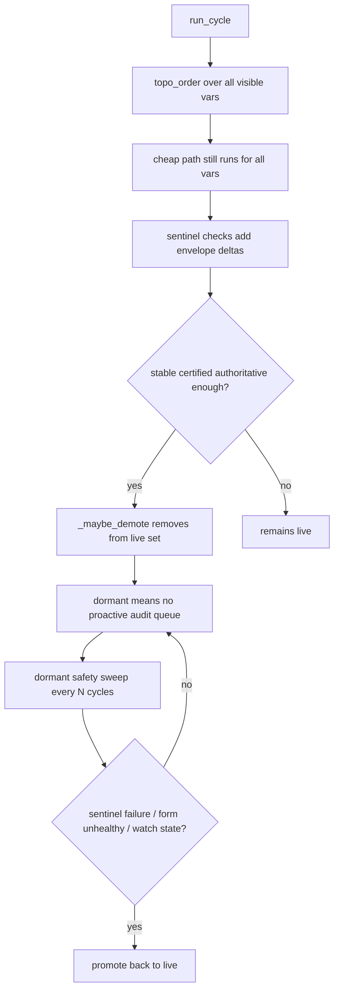
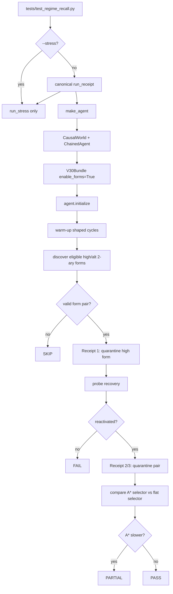

# DRETH run flowchart — current executable paths

This chart separates the normal CLI run, the regime-recall receipt harness, and the inactive/scaffold paths. It is meant to replace historical `run_flowchart.md` notes that mixed implemented behavior with future design.

## Entry points

```bash
python3 dreth_causal_v28.py [flags]
python3 -m pytest -q
python3 tests/test_regime_recall.py
python3 tests/test_regime_recall.py --stress
python3 scripts/bench_forms.py [flags]
```

## Current invariant summary

- `dreth_causal_v28.py` is a compatibility wrapper into `dreth.cli.run`.
- `--mode v29-algebraic-only` is the strongest currently demonstrated efficiency path.
- `--mode v29-equiv-only` exists but may be neutral depending on seed/horizon.
- v30 forms are default-enabled unless disabled, so `--mode v28` is not necessarily pure v28.
- Dormant vars are skipped for proactive audit queueing, not for all sentinel work.
- Adaptive budget is computed but intentionally not used.
- `TiedFrontier` exists as a dataclass only; it is not a live nareth/frontier mechanism yet.
- `total_interventions` is not a complete intervention-observation counter.

## CLI path

```mermaid
flowchart TD
    A[dreth_causal_v28.py] --> B[dreth.cli.run]
    B --> C[parse_args]
    C --> D[CausalWorld]
    D --> E[ChainedAgent]
    E --> F{mode starts v29?}
    F -- yes --> G[load dreth_extensions]
    F -- no --> H[no extension]
    G --> I{forms enabled?}
    H --> I
    I -- yes/default --> J[V30Bundle attached]
    I -- no/--disable-forms --> K[v30=None]
    J --> L[agent.initialize]
    K --> L
    L --> M[cycle loop]

    M --> N[world perturb/reveal]
    N --> O{reveal?}
    O -- yes --> P[agent.on_variable_revealed]
    O -- no --> Q[agent.run_cycle]
    P --> Q

    Q --> R[v30.on_cycle_start if attached]
    R --> S[dormant maintenance]
    S --> T[topological order]
    T --> U[per-var cheap path]

    U --> V{trass?}
    V -- yes --> V1[trass skip]
    V -- no --> W{compression valid?}
    W -- yes --> W1[compression skip]
    W -- no --> X{sentinels pass?}
    X -- yes --> X1[sentinel skip + envelope delta]
    X -- no --> Y[queue full audit / invalidate closure]

    Y --> Z[priority audit budget]
    Z --> AA[_try_form_hypothesis if forms]
    AA --> AB{form match?}
    AB -- yes --> AC[_install_var form hypothesis]
    AB -- no --> AD[_full_audit_var -> fit_var]
    AD --> AE[_install_var]
    AC --> AF[v30 hooks / extension hooks / metrics]
    AE --> AF
    AF --> M
```

## Full audit path



Current gap: this path records exact `tie_set`, but not `near_tie_set`, `frontier_candidate_preds`, or separating probes. `TiedFrontier` is therefore not operational.

## Install path



Needed change: extend exact-tie churn suppression to same-parent near-tie frontier churn, while still treating parent changes as structural.

## Dormant partition path



Invariant: do not replace the first pass with `live_topo`. That broke form behavior signatures because envelope deltas stopped accumulating.

## Regime-recall receipt path



Receipt semantics:
- R1 recovery failure is a correctness failure.
- A* slower than flat is PARTIAL, not FAIL.
- SKIP means the required form pair did not emerge in that seed/horizon.

## Measurement warnings

The following counters must not be used as final efficiency proof until P0 accounting is fixed:

- `total_interventions`
- form on/off intervention delta
- v29/v30 intervention savings

Use full-audit count as a rough signal only. For probe economy, count actual world intervention method calls.

## Non-paths / scaffolds

These exist in code but should not be described as active capabilities:

- `TiedFrontier`: dataclass only, no active lifecycle.
- `near_tie_set`: not in diagnostics yet.
- `frontier_candidate_preds`: not in diagnostics yet.
- NN proposer scores: trained/passive, not used for decisions.
- Cold storage: experimental; key loading needs repair.
- Adaptive budget: computed, not applied.
